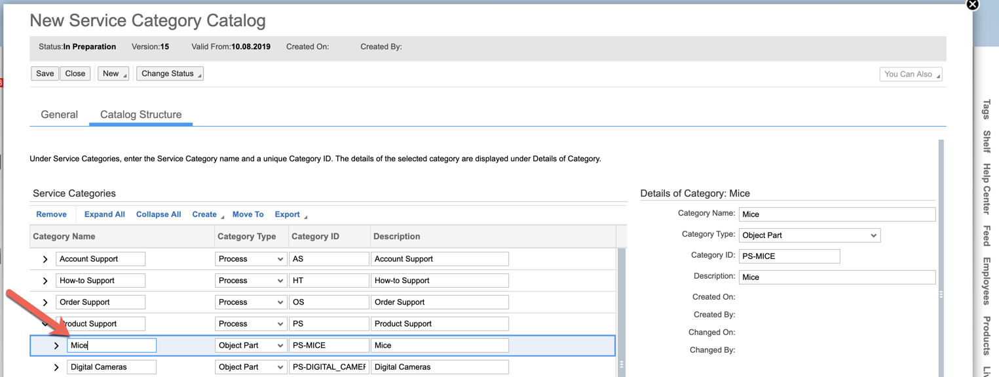
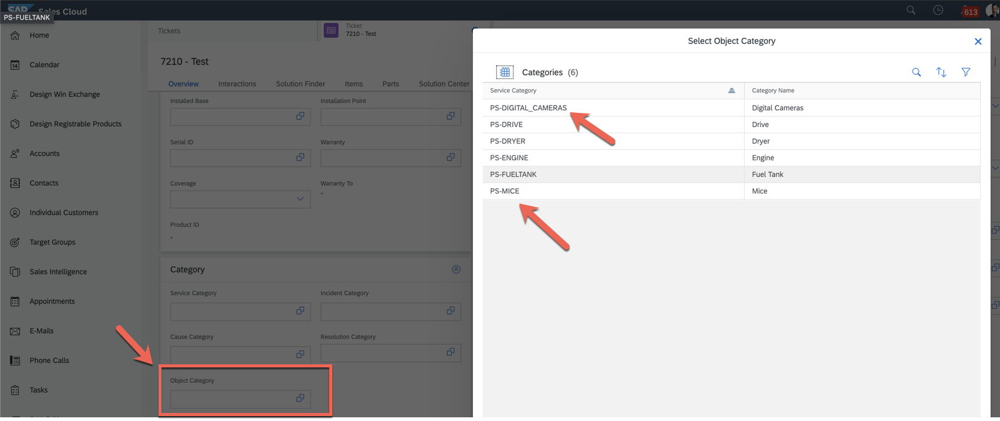

# teched-2019-CAA384

## ToDo
Update [C4C Base url](Lambda/lambda.js) creation once https://github.com/kyma-project/kyma/pull/5236 is available (Kyma 1.4)

```
const c4cClient = axios.create({
    baseURL: `${process.env.GATEWAY_URL}/sap/c4c/odata/v1/c4codataapi` // ==> remove path
    timeout: 20000,
    headers: c4cHeaders
});

```
## About

This scenario is about streamlining service ticket processing using Machine Learning. Tickets (Service Request) are created in [SAP Cloud for Customer / C4C](https://help.sap.com/viewer/product/SAP_HYBRIS_CLOUD_FOR_CUSTOMER/1908/en-US) through the e-mail channel. Every Ticket creation triggers an extension on SAP CP Extension Factory Kyma Runtime which will extract the images attached to the e-mail and classify them using a [product image classifier API](https://api.sap.com/api/product_image_classification_api/resource) from the SAP Leonardo Machine Learning Foundation - Functional Services. The best result will be mapped to the service request Object Category. This can be used to assign it to the right team/person for processing. By eliminating a manual classification step from the ticket routing procedure we can reduce the time to first (meaninful) response KPI significantly.

## Setup C4C

The basic setup of C4C E-mail configuration is best described in this [blog](https://blogs.sap.com/2016/09/19/email-response-management-in-c4c-part-1-cloud-for-service-expert-corner/). What is important is to ensure that emails are sent to the right e-mail address. Say your tenant is https://**my346705**.crm.ondemand.com/. Then your e-mail should be cod.servicerequest@**my346705**.mail.crm.ondemand.com.

Beyond that you need to setup the categories. This is described in the following [video](https://documents.wdf.sap.corp/share/s/fYIfdOGCSaqD0_1dH2gxoQ). I recommend to perform the steps in the HTML 5 client: Administrator -> Service & Social -> Service Categories. Here you can create a catalog with Product Categories. The Example code requires the following categories (parent hierarchies will be implicitly added to the ticket): 

* PS-MICE
* PS-DIGITAL_CAMERAS
  
  

When changing an existing catalog, make sure to maintain validity dates (default is today + 1 as valid from date).

On the ticket itself these categories can be maintained as follows:



[SAP CP Extension Factory Setup](https://help.sap.com/viewer/d5fec61c279741048109d851d4d3d1ad/1908/en-US/f9d56b2aeb3f42ddb8770fd31d4a115f.html) needs to include the `Ticket.Root.Created` event. The C4C API needs to be accessible through privileged user.

## Setup Leonardo

In a realistic scenario the product image classifier would need to be [re-trained](https://help.sap.com/viewer/a86b12f81f424c45a0e7c83c1d5025c4/1907B/en-US) to recognize the specific product categories intended. However for this scenario we will only use the following images:


These are recognized by default. To call the sandbox implementation go to [SAP API Business Hub](https://api.sap.com/api/product_image_classification_api/resource) and logon. Then you can aquire an APIKey:


This Key is required as a credential to invoke the classifier.

Also the url is requires. This is: `https://sandbox.api.sap.com/ml/prodimgclassifier`


## Deploy to SAP Cloud Platform Extension Factory

To deploy the code to Kyma perform the following steps:

1. Bind the C4C Application to your namespace (assuming `ted-c4c` for the remainder)
2. Go to the `ted-c4c`  namespace and instantiate `SAP Sales Cloud`
3. Create a Lambda (assuming `classify-service-request-image` for the remainder)
4. Select `Ticket.Root.Created - v1` as Event Trigger
5. Insert [Lambda/lambda.js](Lambda/lambda.js) as code
6. Insert [Lambda/package.json](Lambda/package.json) as dependencies
7. Bind to `SAP Sales Cloud` Service Instance (name `sap-sales-cloud-<rand>-<rand>`)
8. Create Environment Variable for `APIKEY` (to obtain value see [Setup Leonardo](#setup-leonardo)) and `LEONARDO_URL` (https://sandbox.api.sap.com/ml/prodimgclassifier)
9. Create the lambda. 

To trigger create a ticket.

## Lambda Local Testing / Debugging

Developing code often requires debugging and other activities best performed locally. Therefore the [Test/tester.js](Test/tester.js) script is provided. It will mock the relevant parts of the SAP CP Extension Factory [Kyma Runtime Serverless Framework](https://kyma-project.io/docs/components/serverless/).

To still benefit from the Kyma Application Gateway compopnent you need to do the following:

1. Identify the Kubernetes Service representing the C4C API in the kyma-integration namespace (`kubectl get svc -n kyma-integration`)
2. Expose the service locally on your machine: `kubectl port-forward -n kyma-integration svc/<service name here> 8081:80`. This will enable you to call C4C through the following curl command: 
```
curl -X GET \
  'http://localhost:8081/sap/c4c/odata/v1/c4codataapi
  -H 'Accept: application/json' \
  -H 'Host: <service name here>' 
```
3. Setup the [Test/.env](Test/.env) with `APIKEY` and `HOST`
4.  Install dependencies through `nmp install`
5.  Start the application `node tester.js`

Now you can execute the lambda code locally through the following curl command
```
curl -X GET \
  'http://localhost:3000?entity-id=<your ticket uuid>' 
```
