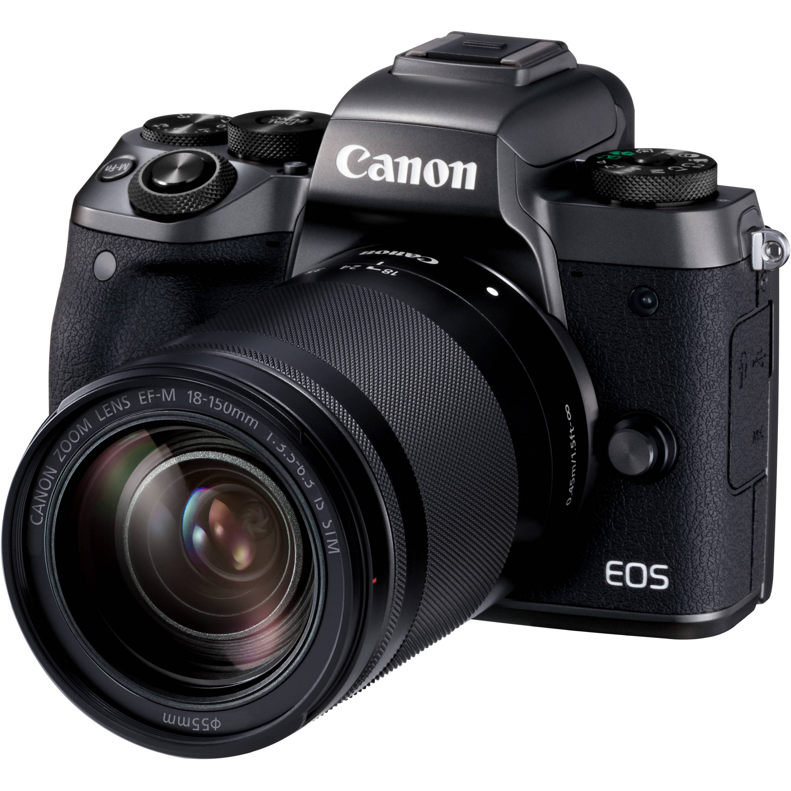

## Setup Leonardo for Image Classification

In a realistic scenario the product image classifier would need to be [re-trained](https://help.sap.com/viewer/a86b12f81f424c45a0e7c83c1d5025c4/1907B/en-US) to recognize the specific product categories intended. However for this scenario we will only use the following images:

These are recognized by default. To call the sandbox implementation go to [SAP API Business Hub](https://api.sap.com/api/product_image_classification_api/resource) and logon. Then you can aquire an APIKey:

This Key is required as a credential to invoke the classifier.

Also the url is required. This is: `https://sandbox.api.sap.com/ml/prodimgclassifier`

**Keep the sandbox url and *API Key* handy, we would need this in our lambda function**